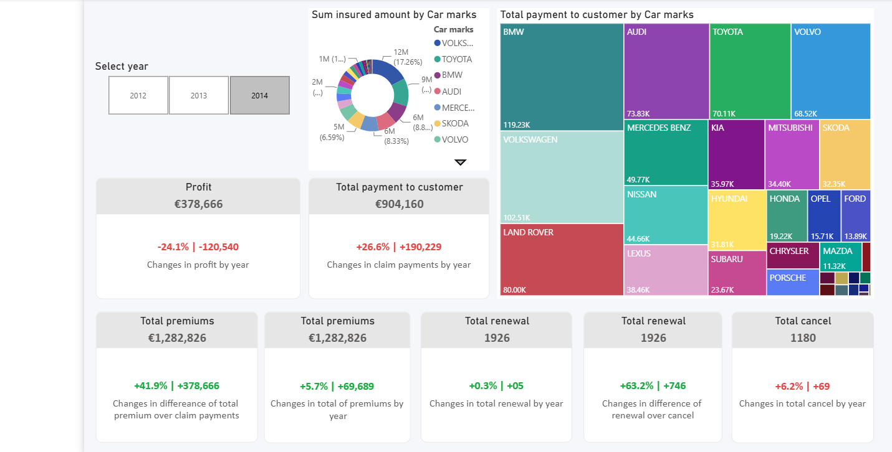
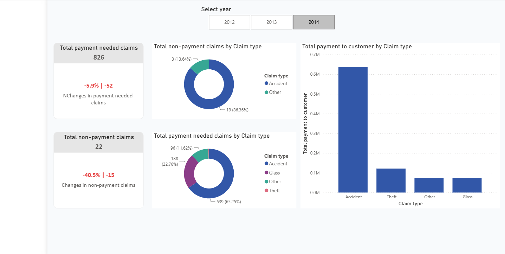
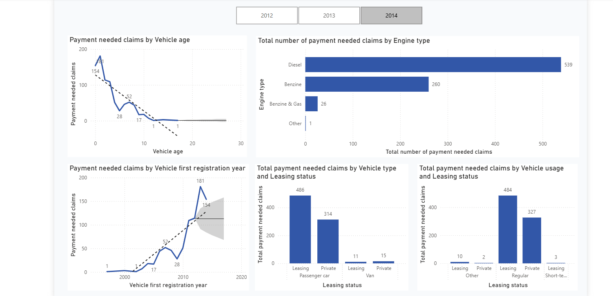
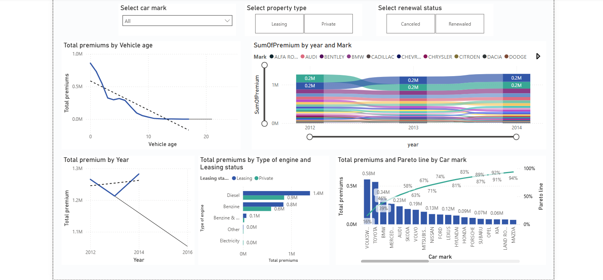
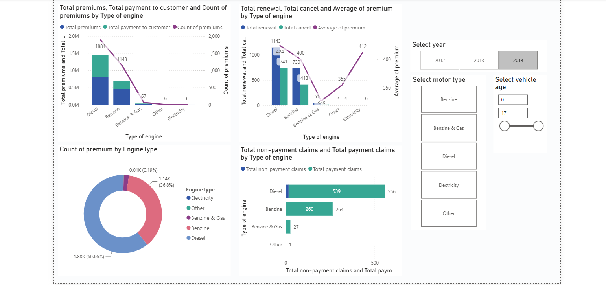
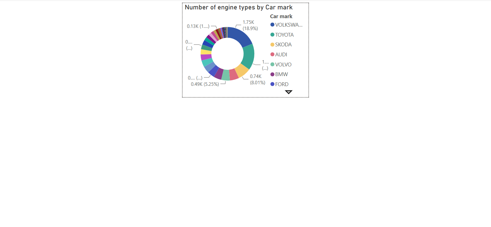

# 🚗 Motor Insurance Claims Analysis Dashboard

## 📌 Project Overview

This project is an interactive Power BI dashboard developed to analyze motor insurance claims, premiums, renewals, cancellations, customer claim payments, and vehicle-related trends.

The dashboard helps insurance companies understand claim patterns, monitor business performance, and make data-driven decisions using interactive visualizations.

---

## 🎯 Project Objectives

- Analyze motor insurance claim trends.
- Monitor premium collection and customer claim payments.
- Track policy renewals and cancellations.
- Evaluate profitability across insurance products.
- Analyze vehicle, engine, and customer claim behavior.

---

## 🛠️ Tools & Technologies

- Microsoft Power BI
- Power Query
- DAX (Data Analysis Expressions)
- Microsoft Excel
- Data Modeling

---

## 📊 Key KPIs

- Total Premium
- Total Customer Claim Payment
- Total Profit
- Total Renewals
- Total Cancellations
- Total Non-payment Claims
- Payment Needed Claims

---

## 📈 Dashboard Pages

### 1️⃣ Portfolio

Executive dashboard containing overall business KPIs, yearly comparison, premium collection, customer payments, renewals, cancellations, vehicle brand analysis, and insurance performance.



---

### 2️⃣ Introduction of Claims

Analysis of insurance claims including:

- Payment Needed Claims
- Non-payment Claims
- Claim Types
- Customer Payment Distribution



---

### 3️⃣ Trends in Claims

Analysis of claims based on:

- Vehicle Age
- Vehicle Registration Year
- Engine Type
- Vehicle Type
- Vehicle Usage



---

### 4️⃣ Trends in Sales

Sales and premium analysis including:

- Premium by Vehicle Age
- Premium by Year
- Premium by Engine Type
- Pareto Analysis
- Vehicle Brand Analysis



---

### 5️⃣ Motor Product Profitability

Product profitability analysis including:

- Premium by Engine Type
- Customer Payments
- Renewals
- Cancellations
- Average Premium
- Engine Type Performance



---

### 6️⃣ Custom Tooltip (Engine by Car Mark)

Custom tooltip page used to provide additional details for engine type distribution by car manufacturer.



---

## 💡 Business Insights

- Identified claim trends across different vehicle brands.
- Compared insurance premiums with customer claim payments.
- Monitored renewal and cancellation performance.
- Evaluated profitability across insurance products.
- Analyzed claim behavior using engine type and vehicle characteristics.
- Created interactive dashboards using slicers, KPIs, drill-through, and custom tooltips.

---

## 📂 Repository Structure

```
Motor-Insurance-Claims-Analytics
│
├── Motor Insurance Claims Analysis Dashboard.pbix
├── Datasets
│   ├── claims.xlsx
│   └── policies.xlsx
├── Screenshots
│   ├── Portfolio.png
│   ├── Introduction_of_claims.png
│   ├── Trends_in_claims.png
│   ├── Trends_in_sales.png
│   ├── Motor_product_profitability.png
│   └── Custom_tool_tip.png
└── README.md
```

---

## 📧 Author

**Saumya Singh**

- LinkedIn: *(linkedin.com/in/saumya-singh-3994a9208)*
- GitHub: https://github.com/Saumyasingh99

---
